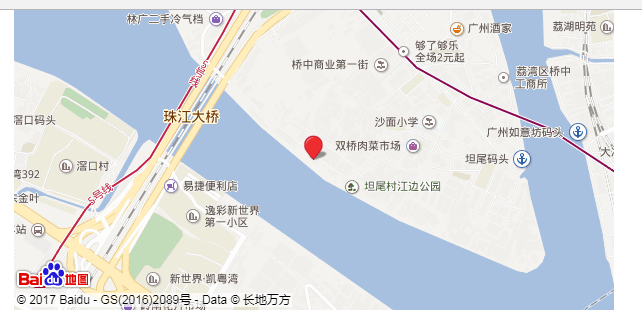

# js百度地图开发mapBaidu

效果如下'\'\';\';\




 百度地图
 
 百度地图的使用 
 
 [地址 - http://developer.baidu.com/map/](http://developer.baidu.com/map/)	
 


      注册百度开发者
         如何创建应用
           应用类型 - 服务器
           启用服务 - 默认全部启用
           请求校验方式 - IP白名单校验
           IP白名单 - 0.0.0.0/0
           得到应用的秘钥


      使用百度地图的步骤
        HTML页面
            引入百度地图的JS文件
              http://api.map.baidu.com/api?v=2.0&ak=您的密钥
            定义容器元素 - 用于显示百度地图
              <div></div>
        JavaScript
           创建百度地图的Map对象
              new BMap.Map(容器的ID);
           设置百度地图的中心和显示级别
              centerAndZoom(center,zoom)
	             center - 设置地图的中心位置(String)
	             zoom - 设置地图的显示级别(3 - 19)  


百度地图API

核心类

     Map
         构造器 - new BMap.Map(容器的ID)
         返回一个Map核心对象
         方法
          修改状态方法
            centerAndZoom(center,zoom)方法
            作用 - 初始化方法(必要)
            setCenter(center)方法
            作用 - 设置中心点
          控件方法
           addControl(control)方法 - 添加控件
           removeControl(control)方法 - 删除控件
          遮盖物方法
            addOverlay()方法 - 添加遮盖物
            removeOverlay()方法 - 删除遮盖物
            openInfoWindow()方法 - 打开信息窗口
            closeInfoWindow()方法 - 关闭信息窗口
          右键菜单方法
            addContextmenu()方法 - 添加右键菜单
            removeContextMenu()方法 - 删除右键菜单  


基础类

      Point
          构造器 - new BMap.Point(lng,lat)
             属性
             lng - 表示经度
             lat - 表示纬度
	     
 控件类
 
       ScaleControl - 比例尺
       NavigationControl - 缩放和平移
       MapTypeControl - 地图类型
       
 遮盖物类
 
       Marker - 标注
       InfoWindow - 信息窗口
       
 右键菜单类
 
       ContextMenu - 自定义菜单
       MenuItem - 菜单选项                                           


all code:
```
<!doctype html>
<html lang="en">
<head>
    <meta http-equiv="Content-Type" content="text/html; charset=utf-8" />
    <meta name="viewport" content="initial-scale=1.0, user-scalable=no" />
    <title>百度地图地址解析</title>
    <style>
        body, html,#allmap {
            width: 100%;
            height: 100%;
            overflow: hidden;
            margin:0;
            /*font-family:"微软雅黑";*/
        }
        #allmap{
            width:600px;
            height:300px;
            margin:0 auto;
        }
    </style>
</head>
<body>
<div id="allmap"></div>
</body>
</html>
<script src="http://api.map.baidu.com/api?v=2.0&ak=327GGLm6A62GfdvGy3L48b6P1clK2QRe"></script>
<script>
    // 百度地图API功能
    var map = new BMap.Map("allmap");
    var point = new BMap.Point(116.331398,39.897445);
    map.centerAndZoom(point,12);
    // 创建地址解析器实例
    var myGeo = new BMap.Geocoder();
    // 将地址解析结果显示在地图上,并调整地图视野
    myGeo.getPoint("广州市荔湾区坦尾村", function(point){
        if (point) {
            map.centerAndZoom(point, 16);
            map.addOverlay(new BMap.Marker(point));
        }else{
            alert("您选择地址没有解析到结果!");
        }
    }, "北京市");
</script>
```
